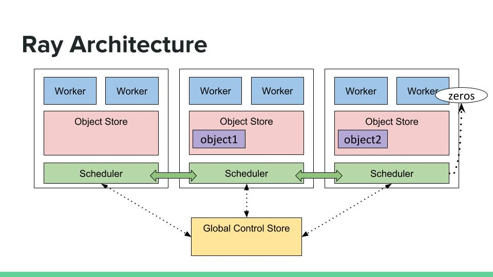
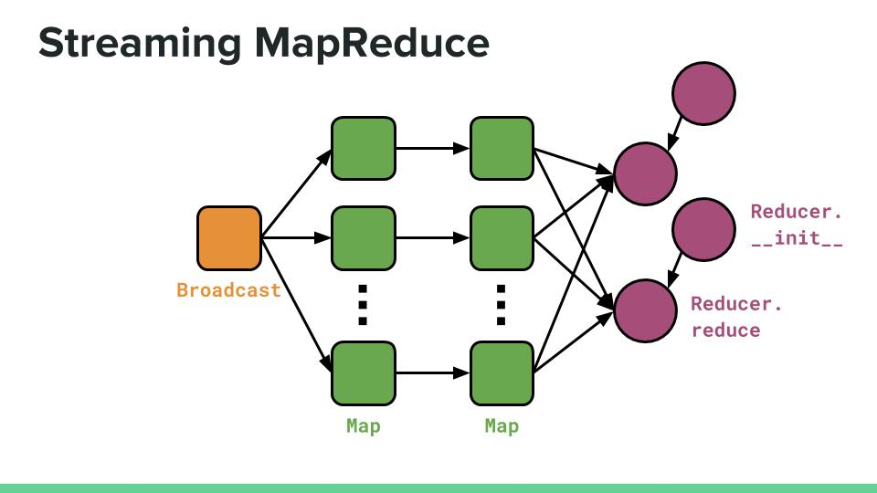
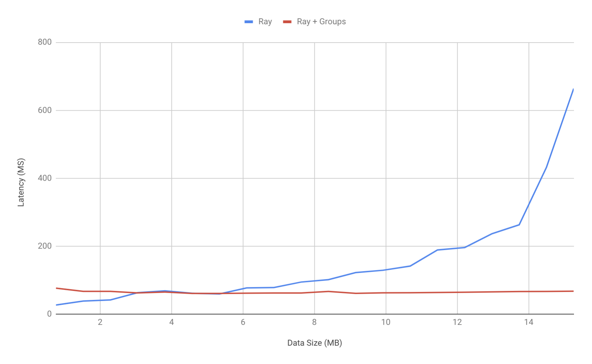
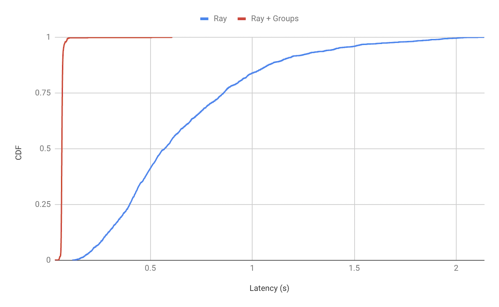

# Introduction
Machine learning systems in production may require a diverse array of applications, requiring everything from hyperparameter search to train a model to stream processing to ingest data.
In the past, specialized systems have been built for each of these individual applications, leaving the burden of integrating these systems on the user, with a potentially prohibitive performance cost.
[Ray](https://github.com/ray-project/ray) is a system that makes it easy to develop and deploy applications in machine learning by exposing higher-level Python libraries for traditionally disparate applications, all supported by a common distributed framework.
Ray does this by exposing a relatively low-level API that is flexible enough to support a variety of computation patterns.
This API allows the user to define *tasks*, which represent an asynchronous and possibly remote function invocation, and *actors*, which represent some state bound to a process.

Although Ray's low-level API enables it to support a diverse set of distributed applications, there are often large performance gains that can be realized by exploiting a higher-level semantic model.
For example, Apache Spark leverages constrained, well-defined distributed data abstractions (i.e., RDDs and DataFrames) and operations (e.g., `map`, `join`, etc) to offer high performance and low-cost fault tolerance for MapReduce- and SQL-like computations.
This project is the first step in exploring whether it is possible to provide high performance for well-defined applications such as MapReduce and stream processing using the low-level Ray API.
To achieve high performance, we expose a scheduling interface for specifying dependencies between logically connected groups of tasks, implement a scheduling policy that uses this information, and introduce a simple intermediate representation with MapReduce semantics that takes advantage of it.
We focus on scheduling, as it has a high impact on end-to-end application performance, but this idea could be applied to other performance-critical problems, such as garbage collection.

To demonstrate the performance gains realized by group scheduling, we implement and evaluate a simple stream-processing application on top of our IR.
The application emulates receiving an input batch of data every 100MS, then transforming it through a set of stateless map and stateful reduce operations.
We chose this as a target application because it has a clear semantic model, is performance-sensitive, and is an example of something that might be done by a Ray user but is not what Ray was designed for.

# Background
## Ray API
The Ray API exposes two main primitives: *tasks* to represent functional programming and *actors* to represent object-oriented programming.
A task may be specified and created as follows:
```python
@ray.remote
def random(shape):
    return np.random.rand(shape)
id1 = random.remote()
id2 = random.remote()
```
In this code example, the `ray.remote` decorator indicates that the `random` function may be run as a task.
A task can be created by calling `random.remote()`, which triggers an asynchronous and possibly remote invocation of the `random` task.
The returned *future* can be used to either get the value returned by the `random` task, or as an input to another task:
```python
@ray.remote
def dot(a, b):
  return np.dot(a, b)
id3 = dot.remote(id1, id2)  # Pass the futures as arguments to another task.
ray.get(id3)  # Returns the result of the dot task.
```

To support distributed *state*, a Ray user can also define and create an *actor*, which represents an object that is bound to a particular Python process.
When an actor is created, the user receives a *handle* to the actor that can be used to submit methods on the actor's state.
```python
@ray.remote
class Reducer(object):
    def __init__(self):
        self.value = 0
    def get(self):
        return self.value
    def add(self, value)
        self.value += value

reducer = Reducer.remote()
ray.get(reducer.get.remote())  # Returns 0.
```
Both tasks and methods called on an actor can take in and return a future, making it easy to interoperate between functions and objects.
For instance, the `reducer` actor can be used to store the results of previous `dot` tasks:
```python
reducer.add.remote(id3)
ray.get(reducer.get.remote())  # Returns the result of the dot task.
```

## Ray Architecture
The Ray API is relatively low-level, so a typical Ray program will often consist of a large number of tasks or actor methods of possibly short (<10ms) duration.
Therefore, the architecture is designed to scale horizontally while also reducing the computation overhead, in terms of latency per task, as much as possible.
There are two important architecture features to note for this project: (1) application data management and (2) distributed scheduling.



As Ray was originally designed for machine learning applications, interoperability with popular Python libraries like [`numpy`](http://www.numpy.org/) is a priority.
Ray also aims to make it easier to run Python programs on multicore machines.
Therefore, Ray stores application data in a shared-memory object store per node using a zero-copy format called [Apache Arrow](https://arrow.apache.org/).
Worker processes interact with the object store directly to retrieve and store task arguments and return values, respectively, allowing worker processes on the same node to efficiently share common data.

Ray uses a distributed scheduler to manage resources on a single node and across the cluster.
An instance of the scheduler runs on each node and is responsible for dispatching tasks according to the local resource availability (e.g., number of CPUs).
The scheduler is also responsible for managing each task's data dependencies and dispatching a task only when its data dependencies are local.
Data dependencies can become local if the task that creates the data executes locally, or if the scheduler fetches the data from another node.

The Ray scheduler has to contend with a number of potentially conflicting requirements.
For instance, since fetching an object incurs some delay, it is often beneficial to colocate dependent tasks.
However, achieving the best performance overall for certain workloads may require a balance between colocating tasks and global load-balancing, to account for resource capacity.
The right balance may depend on the application-specific factors such as task duration, data size, and task load.

## Stream Processing

### Example
The goal behind this project is to explore the feasibility of supporting a domain-specific application on Ray with good performance competitive with that of a specialized system built for the application.
The representative example that we use for the project is a streaming (i.e., iterative) map-reduce application, which is generally considered to be well-supported by either a specialized stream processing system, like [Apache Flink](https://flink.apache.org/), or a bulk synchronous parallel-style system, like [Apache Spark](https://spark.apache.org/streaming/), due to the high-throughput data processing requirements.

The Ray API is much lower-level than those of these specialized systems, so supporting such an application in Ray requires the developer to specify tasks at a much finer granularity.
Specifically, the processing for each batch of data from the input stream must be expressed as a separate Ray task and parallelism is defined explicitly through the number of tasks in a phase.
While a higher-level library could easily be developed to hide the details of this batching from the user, this application is still challenging to support from a systems perspective because the latency overhead per task must be as low as possible in order to get comparable performance.

We can see this in the example below, which shows how one would write a stream processing application in Ray.
This application creates an input stream that produces batches of data every 100ms, performs some data processing in parallel (*map*) over these batches, then aggregates (*reduce*) the final results.
The map phase is implemented by submitting an explicit number of `map_step` tasks equal to the desired parallelism.
The reduce phase is implemented by starting a number of `Reducer` actors at the beginning of the job, then calling methods on the actors that depend on the results of the map phase.
A new map and reduce phase is started every time a new batch of input data arrives.
```python
reducers = [Reducer.remote(i) for i in range(num_reducers)]
dependencies = generate_dependencies.remote(data_size)

for _ in range(num_iterations):
    # Here, parellelism would generally be set to something like num_nodes * NUM_CPUS_PER_NODE.
    map_ins = [map_step.remote(dependencies) for _ in range(parallelism)]
    shuffled = [shuffle.remote(len(reducers), map_in) for map_in in map_ins]
    [reducer.reduce.remote(*shuffled) for reducer in reducers]
    time.sleep(0.1)  # Simulates waiting for the next batch of data.

# Collect the final results.
latencies = ray.get(
  [reducer.get_result.remote() for reducer in reducers]
)
```

Data processing makes up a significant part of this application, resulting in the performance of a cluster depending directly on the scheduling policy used to place tasks.
When the tasks in this example are very short compared to the amount of input and intermediate data, unnecessary data transfer dominates the job time.
By examining the computation graph for a single iteration of the application, we can determine an optimal scheduling policy that minimizes unnecessary data transfer to 0, assuming that the ratio between task duration to data transfer is sufficiently low.



In the above figure, we show tasks with rounded squares and actor methods with circles.
Data dependencies between tasks are represented by the black arrows, and stateful dependencies between subsequent actor methods are represented with the gray arrows.
There are two common patterns of data transfer between tasks in this figure.

First, using the first `Map` phase as an example, the optimal scheduling policy should first colocate individual tasks onto the same node as the single `Broadcast` task.
Then, the `Broadcast` task's outputs can be used directly by the `Map` tasks without data transfer.
Once the resources on that first node are exhausted, the scheduling policy should pick another node on which to pack `Map` tasks, and so on.
Spilling the load to other nodes is necessary to maximize parallelism.
The same strategy should be used to pack the `Reducer` actors together, since all reducers share the same input data, the outputs from the second `Map` phase.

Second, using the second `Map` phase as an example, the optimal scheduling policy should choose to colocate with tasks from the previous phase as much as possible.
In this part of the computation, each `Map` task depends only on a task in the previous phase.
Therefore, assuming that resource constraints are still met, colocating each task with the task requires zero data transfer.

### Challenges
There are two difficulties in implementing the above scheduling policy directly in the Ray backend, without any knowledge from the application.
First, Ray tasks are submitted individually and executed eagerly.
In contrast, the above scheduling policies operate over *groups* of tasks and depend on placement information about past task groups.
In order to implement the above scheduling policy without any changes to the API, the Ray scheduler would have to buffer placement decisions about individual tasks.
This could produce high task overhead and determining the optimal time for the buffer to be flushed would be difficult.

Second, actors in Ray cannot be moved once they have been placed.
This is because actors have state and therefore cannot be easily moved to a different process or node.
However, when actors are first created, it is usually not clear yet what their data dependencies are, since these are not specified until methods on the actor are invoked.
In order to place actors to minimize data transfer, the Ray backend would have to delay actor creation until it was clear exactly where the actors should be placed.

The current workaround for Ray users is to explicitly define placement decisions for each task by labelling each task invocation with the node where it should be executed.
However, this solution is awkward and brittle.
The user must manually specify each task's placement decision, and the solution does not work if the cluster configuration changes (e.g., due to node failure).

Our proposal is to expose a higher-level intermediate representation (IR) that can be lazily evaluated to submit task *groups* to the Ray scheduler.
While each Ray task is still submitted individually when the IR is evaluated, this method allows us to attach sufficient but minimal information to each task so that the scheduler can make an optimal placement decision.
In addition, the lazy evaluation allows us to defer actor creation in the frontend until a method has been submitted on the actor.
We envision this IR being used by developers of Ray frontend libraries, such as for stream processing or data processing.

# Design

## Intermediate Representation
To support the target streaming application, we created an intermediate representation that supports MapReduce-style semantics.
The IR currently consists of four nodes:
- `Broadcast(task, n)`: Invokes `task` once and returns `n` handles to its result.
- `Map(task, objects)`: Invokes `task` on each object in `objects`.
- `InitActors(actor, n)`: Initializes `n` stateful actors of the type `actor`.
- `ReduceActors(task, actors, objects)`: Invokes `task` on each actor in `actors`. Each task is passed the full set of `objects`.

Each of these nodes includes optional arguments to be passed to each Ray task/actor call.
To build a Ray program using the IR, the programmer first defines Ray actors and tasks in the usual way.
These actors and tasks can then be passed into constructors of the IR nodes.
IR nodes are subsequently passed into the constructors of other IR nodes, building up a dependency graph for the application.
This dependency graph can then be "semi-lazily" by making a call to the `.eval()` method of a node, which evaluates all necessary dependencies (i.e., a subtree) and returns the result (i.e., an array of futures).

Below is the implementation of our stream-processing application using the IR:
```python
def main(args):
    reducer_args = [[i] for i in range(args.num_reducers)]
    reducers = InitActors(Reducer, args.num_reducers, reducer_args)
    dependencies = Broadcast(generate_dependencies, args.num_nodes * NUM_CPUS, args.data_size)

    for _ in range(args.num_iterations):
        map_ins = dependencies
        for _ in range(args.num_maps):
            map_ins = Map(map_step, map_ins, args=[[start] for _ in range(len(map_ins))])

        shuffle_args = [[args.num_reducers, args.use_groups] for _ in range(len(map_ins))]
        shuffled = Map(shuffle, map_ins, shuffle_args)
        ReduceActors('reduce', reducers, shuffled).eval()

        time.sleep(0.1)

    latencies = ray.get([reducer.get_latencies.remote() for reducer in reducers])
```

In this example, a set of actors is first initialized using `InitActors` and input data is initialized via `Broadcast`.
The data is then iteratively mapped, shuffled, and reduced on a 100MS cadence to emulate a stream-processing application.
Note that in each iteration, the dependency graph is explicitly evaluated using the `.eval()` call.
During the first evaluation, actors are placed, the dependencies are created, and then the map and reduce tasks are executed.
In subsequent evaluations, only the map and reduce tasks will be executed.

We use the semantics between groups of submitted tasks to pass hints to the scheduler for backend placement decisions.
In this case, each map task in the first group depends on the same object (`dependencies`), map tasks in subsequent groups each depend on a single map task from the previous group (`map_ins`->`shuffle`), and the reduce task depends on the entire final group of map tasks (`shuffled`).
To accomplish this, each IR node is assigned a `group_id` and each task within `Map` and `Broadcast` nodes is assigned a `task_id`.
When a node is evaluated, it recursively evaluates its dependencies and then provides their appropriate IDs as scheduler hints when submitting tasks as follows:
- `Broadcast(task, n)`: No dependency information is passed.
- `Map(task, objects)`: If `objects` is a `Broadcast` node, tasks are submitted with its `group_id` as a group dependency. Else, `objects` is a `Map` node and each task is submitted with a single task dependency on the corresponding `task_id` in `objects`.
- `InitActors(actor, n)`: Does not have an implicit dependency, but instead inherits and passes a group dependency from the `ReduceActors` node that calls it (if it has one).
- `ReduceActors(task, actors, objects)`: Passes a group dependency on the `group_id` of `objects`.

Stateful actors cannot be moved once they are initialized, so our semi-lazy evaluation allows us to delay the placement of actors from an `InitActors` node until it can inherit dependency information from a `ReduceActors` node.

To free `group_id` and `task_id` information from the scheduler, we make use of the Python `__del__` method, which is invoked when an object is garbage collected.
When this method is invoked on a node, we make an explicit free call for its `group_id`.
Garbage collection occurs when a node is no longer a part of any dependency graph in scope in the driver program.
This is a convenient way of deleting information that is no longer needed as soon as possible, but could also be replaced by an eviction policy.

## Group Scheduling

We modify the Ray scheduler to leverage each task's group information.
Each task is assumed to either have a group dependency, meaning it depends on all tasks from a given group, or a task dependency, meaning it depends on one other task.
Each task is also assumed to belong to a group.

The main intuition behind the scheduling policy is to pack tasks dependent on the same group as much as possible, and to colocate tasks that depend on a single other task.
Otherwise, the task has no data dependency constraints and it is acceptable to place the task anywhere in the cluster.
The particular details can be found in this [pseudocode](./scheduler_pseudocode.py), which matches the optimal policy described in [Background](#stream-processing).

# Evaluation

For our evaluation, we ran experiments on a 5-node cluster of AWS EC2 m5.xlarge machines using a [modified version](https://github.com/stephanie-wang/ray/tree/cs294-scheduling) of Ray v0.6 that includes the described scheduler changes.
We compare against unmodified Ray, which places tasks by finding a feasible set of nodes according to task resource constraints, then uses a random scheduling policy to pick the node placement.
It does not consider data locality at all, and the randomized policy makes it prone to bad load-balancing decisions.
We run every experiment for 100s and throw out results from the first 25s to account for warmup time.

In the following plot, we compare the average end-to-end latency of all data in the input stream, while varying the data size produced by each task in the map phase.
The inputs to the reduce phase are aggregated locally first, and therefore have approximately the same size for all experiments.
To measure the latency, we measure the difference between each datapoint's ingest time and the time that it reaches a reducer.

Running unmodified Ray at the lowest data size gets >2x better latency than Ray with group scheduling.
This is potentially because unnecessary data transfer does not matter when the data size is so small, and because the tasks are short enough that it is actually not beneficial to load-balance them across the cluster.
However, latencies get exponentially worse as the data size increases.
This is probably because the cost of unnecessary data transfer increases and the effect from poor load-balancing is exacerbated as there is more data to process.

On the other hand, Ray with group scheduling gets a constant average latency of <100ms, no matter the data size.
This is because it avoids the unnecessary data transfer during the map phase, by colocating each map task with its inputs.



In the following plot, we show a CDF of all latency datapoints for a particular data size (~15MB).
We can see that unmodified Ray has high variance, likely due to its randomized scheduling policy.
Ray with group scheduling has much lower variance, although it still has a significant tail that reaches over 500ms, compared to the mean of <100ms.
This tail requires further investigation and is likely due to performance issues in the general Ray backend independent of scheduling.



# Future work

Although we have found that programming directly in our created IR is surprisingly intuitive, it still imposes a burden on the programmer on top of learning the vanilla Ray API.
One future direction (and the original goal of our project) is to use static analysis techniques to automatically infer an IR representation from pure Ray code.
The primary challenge in this is recognizing the correct data dependency patterns between invoked Ray tasks.
However, from our anecdotal experience digging through Ray programs, it seems that many of them are structured to make these patterns evident (e.g., using list comprehensions when submitting a group of tasks).
This suggests that at least supporting automatic scheduling hints for a subset of possible programs is possible with a reasonable amount of effort.
In addition to inferring data dependencies, we would also need to recognize and insert evaluation points for our semi-lazy evaluation.
A simple policy for this, which should cover a large spectrum of programs, is just to evaluate whenever the program accesses the result (i.e., calls `.get()` on a future).
While automatically improving performance of programs in this way is compelling, it could also make programming Ray more opaque to unfamiliar users, so careful consideration would need to be made when deciding if this should be a part of mainline Ray.

In addition to inferring the IR that we presented in this work, we would also like to expand the scope of the work to additional data dependency patterns.
While MapReduce style computation is pervasive in distributed systems, it does not cover the full scope of applications that use Ray.
In particular, Ray is used most often for end-to-end processing of emerging ML (especially RL) workloads, which are not as well-defined as the tried-and-true MapReduce.
The first step in pursuing this would be a large-scale user study to understand other structured computation patterns in Ray programs.

Finally, while the focus in this project was on improving scheduling as a means to improved end-to-end latency, there are also other parts of Ray where higher-level program semantics could be helpful.
For example, information from the frontend program could help with garbage collection of objects.
Currently, this is performed using a simple LRU policy, but this is suboptimal and sometimes occurs in purging objects that are still needed.
Prematurely garbage collecting objects incurs a significant performance penalty as they must be recreated using lineage.
By providing hints from the frontend, objects that are known to no longer be needed in the program could be evicted, making room for more objects that could otherwise have been prematurely garbage collected.
